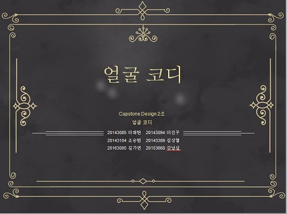
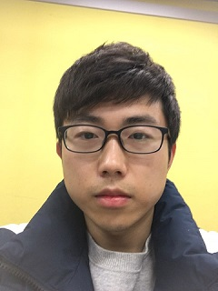

# 얼굴 코디
ARCore를 활용한 자동 합성 시스템
<br/><br/>

<br/>
## 1. 프로젝트 소개

본 프로젝트는 사람의 얼굴 방향, 표정을 기반으로 얼굴을 합성하여 모두가 잘 나온 단체 사진을 얻는 것을 목표로 한다.
수정할 사진 2장을 선택하는 과정을 자동화하여 사용자의 서비스 이용에 편리함을 제공한다. 
사용자는 타 프로그램과 비교하면 3초간의 동영상을 찍는 비교적 간단한 시나리오로 최종 합성 사진을 얻을 수 있다.

## 2. Abstract

This project aims to obtain a group photo that everyone well received by synthesizing faces based on face direction and face expression of a person.
It automates the process of selecting two photos to be modified, thereby providing convenience for users to use the service.
Compared to other programs, users can obtain final edited photos in a relatively simple scenario of taking a three-second video.

## 3. 시나리오

 

## 4. 소개 영상

[](https://youtu.be/NZtXfdSoL8w)

## 5. 팀 소개

### Professor

- 김준호 교수님

### 팀원

- 조승현


````
* 학번 : 20143104
* e-mail : csh4096@naver.com
````
- 이진구


````
* 학번 : 20143094
* e-mail : greentea_latte00@naver.com
````

- 김상열


````
* 학번 : 20143389
* e-mail : ten_ability@daum.net
````

- 김가연


````
* 학번 : 20163085
* e-mail : yellow139@naver.com
````

- 이대현


````
* 학번 : 20143085
* e-mail : dhlee130@naver.com
````

- 강남삼



````
* 학번 : 20153668
* e-mail : 189745297@qq.com
````

## 6. 사용법

추후 추가예정


