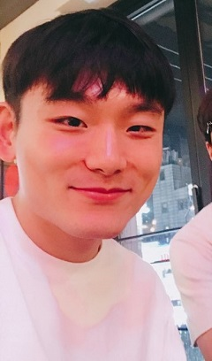
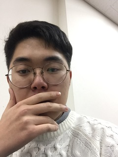

# 얼굴 코디
합성 적합도를 활용한 자동 합성 시스템


## 1. 프로잭트 소개

본 프로젝트는 이미지 합성을 통해 원하는 표정으로 보정할 수 있는 프로그램 개발을 목표로 한다.
완성된 프로그램을 이용할 경우 누구나 수정하고 싶은 사진을 선택하고 합성적합도에 기반한 자동 합성 시스템을 통하여 원하는 표정으로 보정된 사진을 얻을 수 있을 것이다.

## 2. Abstract

This project aims to develop a program that can correct the desired expression through image synthesis.
By using our completed program, you can select the pircure you want to modify and get the edited picture with the desired expression through our automatic synthesis system based on synthetic fitness.

## 3. 소개 영상

[](https://youtu.be/NZtXfdSoL8w)

## 4. 팀 소개

### Professor

- 김준호 교수님

### 팀원

- 조승현



````
* 학번 : 20143104
* e-mail : csh4096@naver.com
````
- 이진구



````
* 학번 : 20143094
* e-mail : greentea_latte00@naver.com
````

- 김상열


````
* 학번 : 20143389
* e-mail : ten_ability@daum.net
````

- 김가연


````
* 학번 : 20163085
* e-mail : yellow139@naver.com
````

- 이대현


````
* 학번 : 20143085
* e-mail : dhlee130@naver.com
````

- 강남삼


````
* 학번 : 20153668
* e-mail : 189745297@qq.com
````

## 5. 사용법

추후 추가예정


