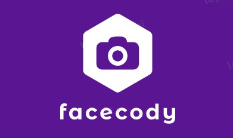
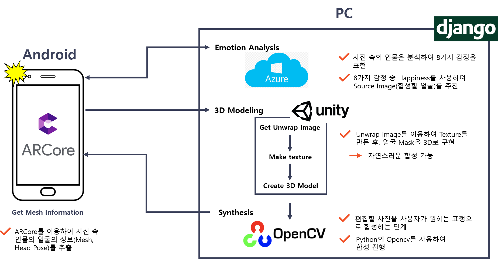
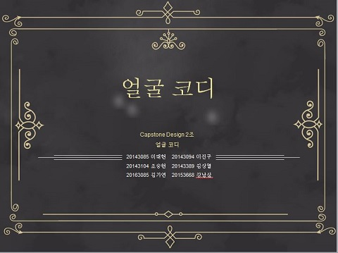
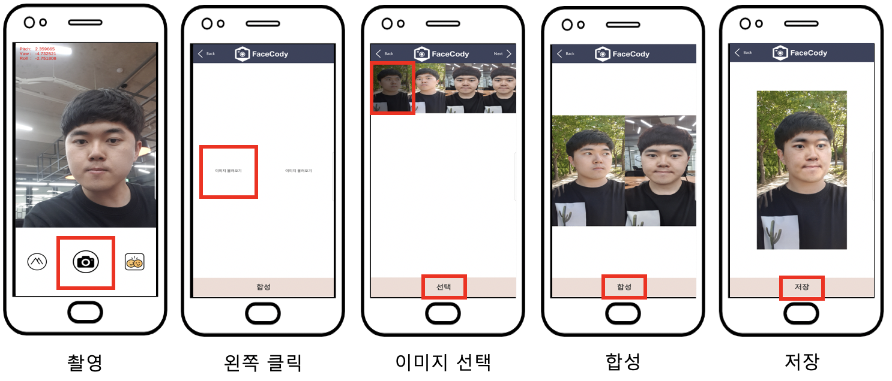
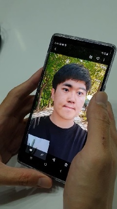
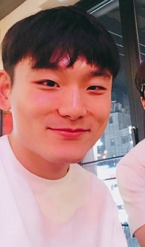
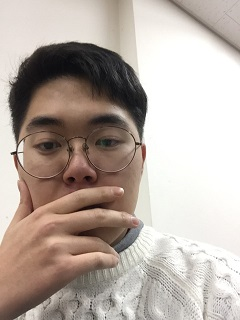
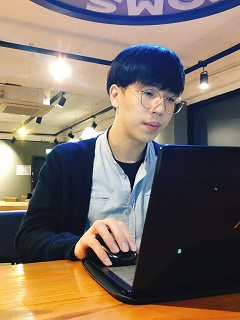
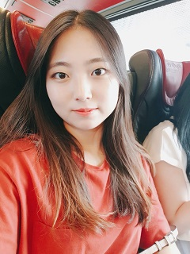
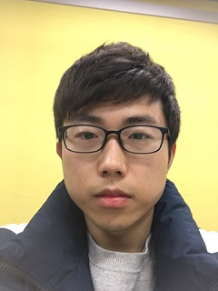

# 얼굴 코디
ARCore를 활용한 자동 합성 시스템
<br/><br/>

<br/>
## 1. 프로젝트 소개

본 프로젝트는 단순한 사진 보정 작업이 아닌 사용자가 원하는 표정으로 합성하는 기능 제공하는 것을 목표로 한다.
수정할 사진 2장을 선택하는 과정을 자동화하여 사용자의 서비스 이용에 편리함을 제공한다. 
사용자는 합성할 사진만 선택하는 간단한 시나리오로 최종 합성 사진을 얻을 수 있다.
또한, 증강현실플랫폼인 ARCore를 합성에 적용하여 새로운 합성기법을 제시하였다.

## 2. Abstract

This project aims to provide a function to synthesize a user's desired facial expression rather than a simple photo correction operation.
It automates the process of selecting two photos to be modified, thereby providing convenience for users to use the service.
The user can obtain the final composite picture as a simple scenario in which only the picture to be synthesized is selected.
Also, ARCore which is an augmented reality platform is applied to synthesis and a new synthesis technique is proposed.

## 3. 시스템 구성도

 

## 4. 소개 영상

[](https://youtu.be/NZtXfdSoL8w)

## 5. 사용법

 


## 6. 시연 영상
[](https://youtu.be/_RtscBERDSk)

## 7. 팀 소개

### Professor

- 김준호 교수님

### 팀원

- 조승현



````
* 학번 : 20143104
* e-mail : csh4096@naver.com
````
- 이진구



````
* 학번 : 20143094
* e-mail : greentea_latte00@naver.com
````

- 김상열



````
* 학번 : 20143389
* e-mail : ten_ability@daum.net
````

- 김가연



````
* 학번 : 20163085
* e-mail : yellow139@naver.com
````

- 이대현


````
* 학번 : 20143085
* e-mail : dhlee130@naver.com
````

- 강남삼



````
* 학번 : 20153668
* e-mail : 189745297@qq.com
````


